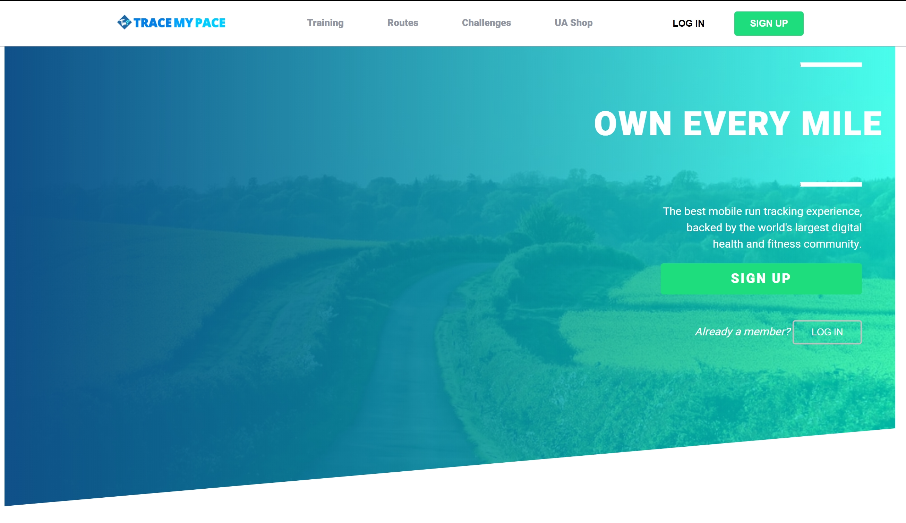

# TraceMyPace

[TraceMyPace](http://tracemypace.herokuapp.com/#/) is a clone of the popular running app MapMyRun that allows users to plan and create routes using google maps.

## Table of Contents

- [Technologies Used](#technology)
- [Features](#features)
- [Maintainers](#maintainers)
- [License](#license)

## Technology

TraceMyPace is a Full-Stack project built using Ruby on Rails, React, Redux, PostgreSQL, Google Maps API, and Heroku.

## Features

Key Features:
1. User Authentication and error handling.
2. Creation/deletion of Routes utilizing Google Maps Api.
3. Logging Workouts based off user-created Routes.
4. Posting Statuses and Comments on Activity Feed.

## Maintainers
[@Sunghan11](https://github.com/Sunghan11)

## License 

@ 2020 Elijah Nam

